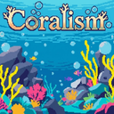
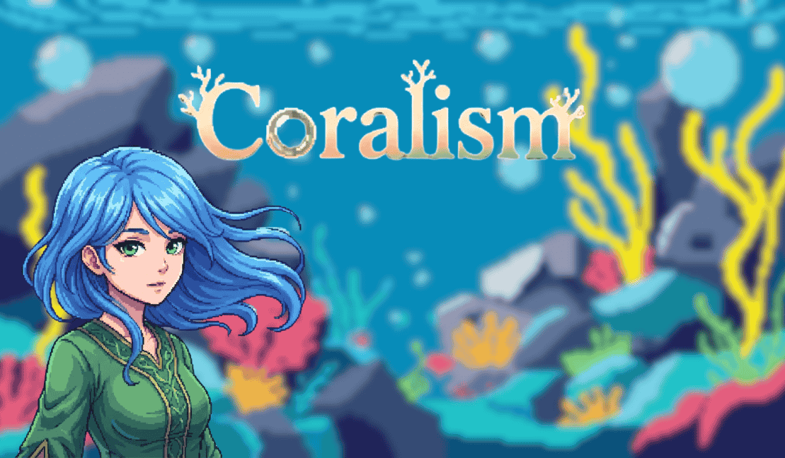

  
   
  <h1>C O R A L I S M</h1>
  
<i>"Where the ocean's silence speaks louder than words."</i>

  

    
    
    
  

---

## 🌊 Synopsis (Latar Belakang)

**Dunia sedang sakit.**  
Langit yang dulu biru kini tertutup kabut asap kelabu. Udara terasa berat, menekan dada setiap makhluk yang bernapas. Bumi tidak lagi menjadi tempat yang ramah; ia merintih di bawah tumpukan sisa-sisa keserakahan manusia.

Di tengah keputusasaan ini, sebuah suara lembut memanggil dari kedalaman samudra. **Tina**, sang penjaga terakhir, menunggu seseorang yang masih memiliki hati. Seseorang yang mau mendengarkan jeritan bisu dari terumbu karang yang patah dan laut yang tercekik sampah.

**Coralism** bukan sekadar permainan tentang membersihkan sampah. Ini adalah sebuah **perjalanan penebusan**. Sebagai sang Penyelamat, Anda memikul tanggung jawab yang telah dilupakan banyak orang: **Kepedulian**.

### Misi Utama:

- **Restorasi:** Menyelam ke dalam lautan yang tercemar dan memulihkan ekosistem.
- **Pembersihan:** Mengumpulkan limbah plastik dan logam yang melukai alam.
- **Penyembuhan:** Menjahit kembali luka-luka karang dengan tangan Anda sendiri.

Jika Anda berhasil, langit akan kembali cerah, dan Bumi akan menuliskan surat cinta terakhirnya untuk Anda.

---

## 👥 Meet the Team (Tim Pengembang)

Project ini dipersembahkan oleh talenta-talenta luar biasa:

| Contributor  | Roles & Responsibilities                                                                          |                                                                           GitHub Profile                                                                            |
| :----------- | :------------------------------------------------------------------------------------------------ | :-----------------------------------------------------------------------------------------------------------------------------------------------------------------: |
| **Kazanaru** | **Lead Backend Developer** (Priority) Project Manager (Secondary) Game Designer (Secondary) |       |
| **Acedar**   | **Lead Artist** Sound Effects (SFX) Visual Assets                                           |              |
| **Gilbert**  | **Lead Frontend Developer** (Priority) Lead Designer (Priority) UI/UX Implementation        |  |

---

## 🛠️ Technology Stack

Game ini dibangun dengan kebanggaan menggunakan teknologi Open Source:

- **Core Engine:** Godot Engine 4.x
- **Scripting:** GDScript (Python-like syntax)
- **Version Control:** Git & GitHub
- **Asset Pipeline:** Pixel Art Workflow

---

  <h3>~ In-Game Preview ~</h3>
  
    
  
<i>"Tempat anak cucumu nanti merebah." — Bumi</i>

  
© 2024 Coralism Team. All Rights Reserved.

